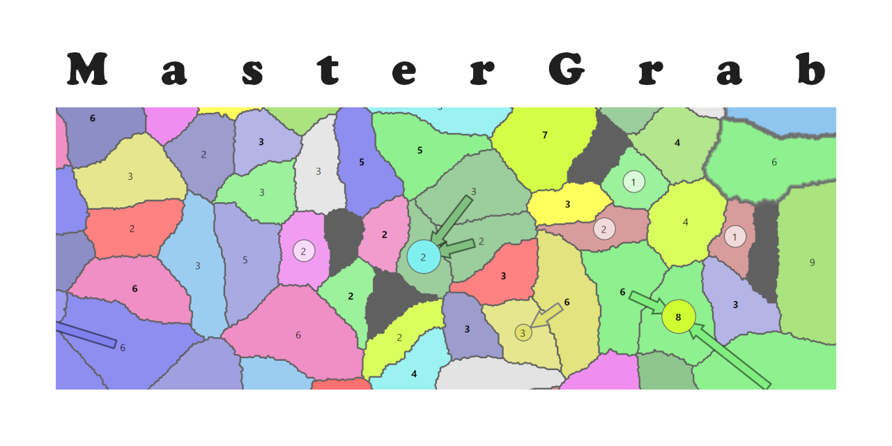
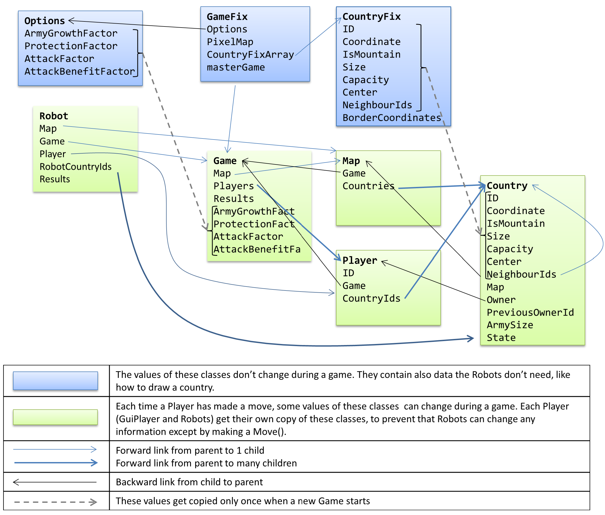

# Introduction
MasterGrab is an open source, turn-based PC game where a human player plays against
several computer players (=Robots), trying to grab all countries on a random map. The game 
is quite fun, because the random map poses different problems every time and 
the Robots make MasterGrab a dynamic play. To win the game, 
strategic thinking is required.

For programmers, it might be even more fun to write your own Robot, which can 
be done with only a few lines of code.

How you can play MasterGrab is described in the Help section of the game. 

# Overview MasterGrab VS Solution
The VS Solution contains the following projects:
- **MasterGrab:** GUI, contains all WPF and Windows related code
- **BL:** Business Logic, i.e. the game engine and all data
- **BLTest:** Unit tests of BL
- **Robots:** Here you can add your own class inheriting from Robot

The projects use .NET 5 and has no other dependencies. Just get MasterGrab 
from Github and you are ready to run.

# Writing your own Robot
Basically, you have just to write a new class inheriting from Robot 
and place it into the Robots project. When MasterGrab starts, it 
searches for these classes and displays them in the Options window, 
where the user can select them for the next game.

## Classes involved in a Game
The game is managed by the `GameController`. The user can select in 
the Options Window which Robot types and how many of them should play, 
how many countries should be on the map and other settings. When 
the user 
presses New Game, the options get sent to the GameController, which 
starts a new Game. It waits first for the user to make a move, then 
it asks each Robot to make a move (`DoPlanMove()`). The robot gets 
a copy of the latest game data, like which Country is owned by which 
Player (human or robot) and what is the size of the army in that 
Country. The Robot cannot change any of this data, that would open 
the door to cheating. The Robot can only tell the GameController which 
is the next move it would like to make.



Some data changes during a game, like who owns which country and some 
data (Options, GameFix, CountryFix) does not change during the game, 
like which countries are neighbours. Whenever a Robot can make a move, 
it gets the Player instance which represents him, holding all the 
information a Robot 
needs. Robot has a Game property, which is actually the root of 
the class tree. Map is a special collection holding all the 
countries.

### Game properties

- **Map** is a collection of countries
- **Players** allows the Robot to investigate the data of all other players
- **Results** shows the move of every player in the last round and if it was a success or failure.
- **AttackFactor** is important for a Robot to decide if he can attack an enemy country. He first adds up the army sizes of his own countries neighbouring that enemy country. That total gets multiplied by AttackFactor, which is smaller than 1. If the result is greater than the defending army's size, the attack wins.

### Player properties
The Robot's Player instance also holds CountryIds with a list of 
all countries that Player (Robot) holds. Note that these are only
unique country ID numbers, which can be used to get the country 
data like this:

```
var country = Map[countryId];
```

### Country properties
Some Country properties are not interesting for Robots, like its coordinates 
on the screen. Country properties used by Robots to calculate their next 
move:

- **NeighbourIds** list the neighbour countries' IDs. 
- **ArmySize** number of attackers in own countries or defenders in enemy countries.

## Code of a very simple Robot
One can use SimpleRobot.cs as starting point for your own robot:

```
using System.Collections.Generic;

namespace MasterGrab {

  /// <summary>
  /// Simple Robot player using only 1 country to attack
  /// </summary>
  [Robot(name: "SimpleRobot", isUsedForDefault: false)]
  public class SimpleRobot: Robot {
```
Any namespace can be used. Important is that SimpleRobot inherits from 
Robot. Using the RobotAttribute is optional. It allows changing the 
class name to a nicer name seen by the user and to indicate if that 
robot should be used in Default options.

Robot provides SimpleRobot easy access to Player (the Robot itself), 
Game, Map, RobotCountryIds (owned countries) and results.

```
    readonly List<Country> attackers;
```
Note that a Robot gets for each move completely new instances of Game,
Countries, etc. For example, it is not possible to reuse a country 
instance from a previous move. However, Country.ID and Player.ID 
are constant. So if a Robot wants to store information about another 
Player over several moves, he must combine that Player's ID with 
the rest of the data he wants to store.

The variable `attackers` is not used to store information between 2 moves, but for 
efficiency reasons it gets created only once and then constantly reused.
```
    public SimpleRobot(): base() {
      attackers = new List<Country>();
    }
```
GameController calls DoPlanMove when it is time for the Robot to make the 
next move. Here is where you place the code for your Robot.
```
    protected override Move DoPlanMove() {
      Country? attacker = null;
      Country? target = null;
      double ratio = 0;
```
Strategy used by SimpleRobot:
- loop through all countries this robot owns
- find the best neighbour to attack. SimpleRobot tries to optimise:
  - size of the neighbour country (the bigger the better)
  - how many defenders (the fewer the better)

loop through every country the Robot owns
```
      foreach (int countryId in RobotCountryIds) {
        var country = Map[countryId];
```
calculate how big is the attacking army
```
        double attackingArmies = country.ArmySize * Game.AttackFactor;
```
loop through every neighbour of this country. Remember the weakest enemy
country compared to your attacking country.
```
        foreach (int neighbourId in country.NeighbourIds) {
          var neighbour = Map[neighbourId];
          if (
            !neighbour.IsMountain && //cannot attack mountain
            neighbour.OwnerId!=Player.Id && //don't attack own country
            neighbour.ArmySize<attackingArmies) //is robot strong enough ?
          {
            //calculate how much stronger the attacker is then the defender
            double newRatio = attackingArmies / neighbour.ArmySize * neighbour.Size;
            if (ratio<newRatio) {
              //found a weaker country to attack
              ratio = newRatio;
              attacker = country;
              target = neighbour;
            }
          }
        }
      }
```
Decide what will be your move after looping through all your countries.
```
      Move move;
      if (attacker==null) {
```
If a Robot decides not to attack, he can select one country and move all armies
from countries he owns around that country into that country. See BasicRobot.cs 
for an example of how this can be done.

SimpleRobot decides to skip one move if he cannot attack.
```
        move = Move.NoMove;
      } else {
        attackers.Clear();
        ////SimpleRobot is a bit stupid and uses only 1 of his countries to attack
        ////It would be better if he would use all of his countries which are neighbours of the attacked countries,
        ////like this:
        ////foreach (int targetNeighbourId in target.NeighbourIds) {
        ////  Country targetNeighbour = Map[targetNeighbourId];
        ////  if (targetNeighbour.OwnerId==Player.Id) {
        ////    attackers.Add(targetNeighbour);
        ////  }
        ////}
        attackers.Add(attacker);
        move = new Move(MoveTypeEnum.attack, Player, target!, attackers);
      }
      return move;
    }
  }
}
```

SimpleRobot is kept on purpose to the bare minimum. A bit more sophisticated 
is BasicRobot, which attacks an enemy country with all his own countries being 
neighbours of the enemy and when there is no good attack to perform, it moves 
his own armies neighbouring one of his countries into that country. This is 
rather important in the later phase of the game.

However, BasicRobot is lacking any strategic planning, like:
- Which attack improves the "shape" of his countries: 
  - When his countries bild a "circle", the countries inside the circle have no enemies.
  - When he manages to get all countries in a column on the screen, less defence is needed.
- Taking into account which is the weakest and strongest opponent
- To tempt 2 enemies to attack each other: If the Robot owns a country surrounded by 2 enemies, that country prevents the enemies from fighting each other. If the Robot's country attacks an enemy country, it will most likely lose and the 2 enemies will start to attack each other.

When you play MasterGrab yourself, you will discover also other strategies, 
which you can then teach your Robot.

To my surprise, even BasicRobot has no strategy, it is actually difficult to 
beat. Meaning it should not be that difficult for you to write an even better 
Robot.